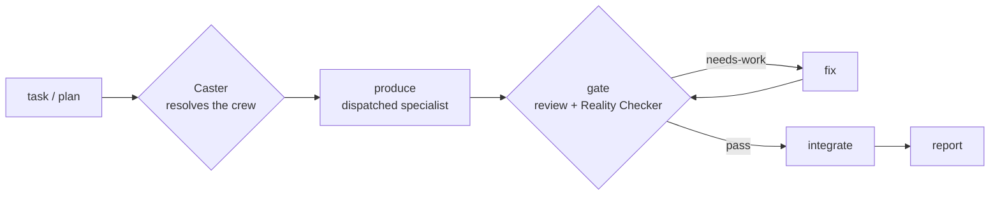

<p align="center">
  
</p>

<p align="center">
  
  
  
  
</p>

<p align="center"><b>Independently-verified multi-agent delivery for any task, with the least code that works.</b></p>

Point dreamteam at a task or an approved plan. It assembles a crew of specialist agents and won't call anything done until an independent reviewer has checked the claims against real evidence. One loop, `produce → gate → fix → integrate`, runs across every domain. Only the crew changes.



The three pieces, glossed on first use:

- **conductor** — the loop you talk to. It dispatches work to specialist agents and reports each verdict. It never writes code itself.
- **Caster** — the selector. It reads your task, picks the crew, and gives each role a cost-aware model tier. The crew prints before any work runs.
- **Reality Checker** — the always-on reviewer. It re-runs the build and tests (or checks data against the claim for research) and rejects anything it can't verify.

### Three pillars

- **correct.** Every workstream passes a verification gate. The Reality Checker sits on every panel, matches claims against evidence (tests for code, data against claim for research), and throws out faked or over-claimed coverage. It also runs a mutation check: a green suite that still passes against a deliberately broken implementation gets rejected, not trusted.
- **versatile.** One loop, a swappable crew. The same machinery handles builds, audits, research, and QA. Only the crew changes.
- **minimal.** The least code that fully works. It gets there without cutting validation, security, or accessibility.

> dreamteam isn't the first verification-led orchestrator; loki-mode and the Edict pattern cover nearby ground. What's different here is the always-on honesty gate.

### Prerequisites

- a supported CLI: Claude Code, Codex, Gemini, or CodeWhale
- a git repo for build-type runs (each producer works in its own worktree)
- paid model-API usage — a run spawns several agents, so see [Cost & scale](#cost--scale)

## Install

Three steps. These are the only install commands in this README; everything else links back here.

**Step 1. Install the two required dependencies.** dreamteam composes existing skills rather than reinventing them, and it needs both of these.

```
/plugin marketplace add obra/superpowers-marketplace && /plugin install superpowers@superpowers-marketplace
npx skills add vercel-labs/skills --skill find-skills
```

- **superpowers** is a Claude Code plugin. It provides `brainstorming`, `writing-plans`, `using-git-worktrees`, `verification-before-completion`, and `finishing-a-development-branch` ([github.com/obra/superpowers](https://github.com/obra/superpowers)).
- **find-skills** is a skill from the Vercel `skills` CLI ([skills.sh](https://www.skills.sh)). It discovers and installs other skills, and it backs the advisory recommender ([github.com/vercel-labs/skills](https://github.com/vercel-labs/skills)).

A missing dependency warns but never blocks. dreamteam substitutes or flags it at runtime. The catch is that any path needing it stays dark until you install it. The `ai-research` profile pulls in a few more optional skills; [Dependencies](#dependencies) has the full list.

**Step 2. Install dreamteam.** Clone this repo, then run the installer for your OS from its root. It publishes `skills/dreamteam/` to `~/.claude/skills/dreamteam/` and runs the dependency check.

```
bash ./install.sh       # Linux / macOS
pwsh ./install.ps1      # Windows
```

**Step 3. Invoke it** with `/dreamteam`. See [Quickstart](#quickstart) and [Usage](#usage) for the invocation shapes.

<details>
<summary><b>Other CLIs &amp; the published-plugin install</b></summary>

**Once published**, dreamteam installs as a Claude Code plugin marketplace:

```
/plugin marketplace add adnantaufique/dreamteam
/plugin install dreamteam@dreamteam-marketplace
```

*(The repo is currently private and not yet live, so the marketplace command doesn't work yet. Use the `install.sh` / `install.ps1` path above for now.)*

**Other CLIs.** The skill is CLI-agnostic. Tool names, dispatch, and model tiers resolve per `skills/dreamteam/references/platforms.md`:

| CLI | Sync | Installs to |
|----|------|-------------|
| Codex | `scripts/sync-to-codex.sh` | `~/.agents/skills/dreamteam/` (+ `AGENTS.md` pointer) |
| Gemini | `scripts/sync-to-gemini.sh` (+ `gemini-extension.json`) | `~/.gemini/agents/dreamteam/` |
| CodeWhale | `scripts/sync-to-codewhale.sh` | `~/.codewhale/skills/dreamteam/` (load via `/skills`) |

(`.ps1` variants exist for each on Windows.)

</details>

## Quickstart

With [Install](#install) done, point dreamteam at a task, a profile, or an approved plan:

```
/dreamteam "add OAuth login to our web app"           # auto-picks the web crew, runs the gated loop
/dreamteam --profile audit "find bugs in this repo"   # read-only, ultrareview-style bug-finder
/dreamteam docs/plans/my-plan.md                      # execute an already-approved plan
```

> You don't have to use the slash command. You can also ask your session agent in plain language, like "use dreamteam to add OAuth login," and it runs the same gated loop. The `/dreamteam` command is shorthand for that.

> The first example uses the `superpowers` sub-skills and `find-skills`. If they aren't installed, the dependency check prints `[ ! ]` warnings and those paths won't fire. See [Install → Step 1](#install).

## What a run looks like

A run prints the crew manifest first. Then it drives each workstream through produce → gate → fix → integrate and reports every verdict with the evidence behind it. Here's an abbreviated transcript for `/dreamteam "add OAuth login to our web app"`:

```text
$ /dreamteam "add OAuth login to our web app"

Caster → crew manifest (profile: web · platform: claude)
  planner    : writing-plans (skill)
  producers  :
    backend  → Backend Architect      capable → opus    : OAuth flow + token handling — multi-file, security-sensitive
    frontend → Frontend Developer      standard → sonnet  : login UI wiring — integration against the new endpoints
  reviewers  :
    Code Reviewer                      capable → opus    : static review + over-engineering / diff-scope check
    Reality Checker                    capable → opus    : re-runs tests; claim↔evidence; mock-integrity (always on)
    Security Engineer                  capable → opus    : added — auth/token handling on the critical path
  gate_policy : min_pass=all · max_fix_iterations=2
  workstream_strategy: sequential

Execution mode? Background subagents or the Workflow tool? [background] › background

── WS1: backend OAuth flow ──────────────────────────────────────────────
Dispatching `backend` for WS1 at capable — background subagents (session mode).
  producer → DONE: /auth/oauth routes + token exchange; 14 unit + 3 integration tests
  gate (parallel panel) → synthesizing…
    Reality Checker  ✗ HIGH: refresh-token test is vacuous — still green when verify_signature()
                       is stubbed to return True (mock stands in for the unit under test)
    Security Engineer ✗ HIGH: state param not validated on callback → CSRF on the OAuth handshake
    Code Reviewer    ✓ pass
  verdict: fix-then-pass (2 must-fixes) → re-dispatching producer with the fix list (iter 1/2)
  producer → DONE: real signature check asserted; state validated + test added
  re-verify → Reality Checker ✓ : perturbed verify_signature() → suite goes RED as expected;
                                   Security Engineer ✓ : CSRF test passes
  verdict: PASS · evidence: 17 unit + 4 integration green, non-vacuous (mutation-confirmed)
  integrate → merged branch ws1-oauth-backend; worktree cleaned

── WS2: login UI ────────────────────────────────────────────────────────
Dispatching `frontend` for WS2 at standard — background subagents (session mode).
  producer → BLOCKED: token-refresh race needs more reasoning than this tier carries
  WS2 failed gate at standard → retrying at capable
  producer (capable) → DONE: refresh guarded; 6 component tests
  gate → Reality Checker ✓ · Code Reviewer ✓   verdict: PASS · evidence: 6 component tests green
  integrate → merged branch ws2-login-ui; worktree cleaned

Run complete · 2/2 workstreams integrated.
Retro → learning persisted: "web+auth → add Security Engineer by default; assert non-vacuous
        token tests." No skill-edit deltas proposed.
```

Every line is a real format from the skill: the manifest (`references/caster.md`), the per-workstream re-anchor and escalation lines (`references/loop.md`), and the `pass / fix-then-pass / needs-work` verdict with its evidence (`references/gate.md`).

## Why dreamteam?

dreamteam is a thin orchestration skill, not a framework you build against. Three differences stand out.

**The honesty gate.** Every workstream passes a mandatory verification gate. An independent Reality Checker re-runs the evidence, and a green suite that still passes against a broken implementation gets rejected (the mutation and mock-integrity check). Plain subagent dispatch and the Task tool hand work out but don't gate it, so you get back whatever the agent claims.

**No app to build.** CrewAI, AutoGen, and LangGraph are full multi-agent frameworks: Python libraries, graphs, and roles you wire up yourself. dreamteam is just a skill. The gate, the conductor-never-codes discipline, and the mutation checks ship as defaults.

**Cross-CLI portable.** The same skill runs on Claude Code, Codex, Gemini, and CodeWhale. Tools, dispatch, and model tiers resolve per `references/platforms.md`, so it isn't tied to one runtime or SDK.

| | Dispatches work | Gates the result | No framework to build | Cross-CLI |
|---|:---:|:---:|:---:|:---:|
| Plain subagent dispatch / Task tool | ✓ | — | ✓ | — |
| CrewAI · AutoGen · LangGraph | ✓ | partial (you wire it) | — | — |
| **dreamteam** | **✓** | **✓ (mandatory + mutation-checked)** | **✓** | **✓** |

## Cost & scale

A run is not a single prompt. A typical task spawns the Caster, a planner, one producer per workstream, a reviewer panel (the Reality Checker plus any domain reviewers, all at the `capable` tier), any fix-loop re-dispatches, and a post-run retro.

So expect roughly N times the tokens and cost of one prompt, and minutes of wall-clock rather than seconds. In practice that's a handful to about a dozen agent dispatches, more for `--profile audit --depth exhaustive` (which is budget-printed and confirm-gated). The numbers depend on the task, so measure your own runs rather than trusting a made-up figure.

Reviewers never drop below `capable`, so they're the largest steady cost. To economize:

- dispatch always runs in the background, so it doesn't tie up your session
- `--cost cheap` biases producers to the cheapest tier that fits; reviewers stay `capable`
- `--autonomy confirm` gates spend by confirming the crew and each verdict before work proceeds
- `--depth shallow|module` and a tighter task keep fan-out small

## Usage

The common shapes. Point it at a task, a profile, or an approved plan:

```
/dreamteam "add OAuth login to our web app"          # auto-pick the crew, run the gated loop
/dreamteam --profile audit "find bugs in this repo"  # read-only bug-finder (nothing lands)
/dreamteam docs/plans/my-plan.md                     # execute an already-approved plan
/dreamteam --cost cheap --autonomy confirm "…"       # economize + gate every verdict
```

`--profile ai-research` splits a run into parallel workstreams in isolated worktrees:

```
/dreamteam --profile ai-research "salvage the leakage finding: expand ∥ polish"
```

**Execution mode.** Both modes run without tying up your session; `--execution` picks how:

```
/dreamteam --execution workflow "add OAuth login to our web app"   # orchestrate via the Workflow tool (Claude Code)
/dreamteam --execution background "find bugs in this repo"          # multiple background subagents
```

The flag pre-sets the run's execution mode, so dreamteam skips the one-time "Background subagents or the Workflow tool?" prompt and uses your choice for the rest of the session. Background subagents are the default and run on every CLI. The Workflow tool is Claude-Code-only, and it fits a run with many independent workstreams. With no flag, dreamteam asks once per session and defaults to background. `--execution workflow` on Codex, Gemini, or CodeWhale is invalid, since none of them has a Workflow tool, so the run falls back to background subagents.

The full flag grammar lives in [Mechanics / Reference](#mechanics--reference).

**Opt-in:** dreamteam runs multi-agent orchestration only when you invoke it.

## How it works

The loop is the `produce → gate → fix → integrate` diagram at the top of this README. Here are the three stages in detail.

1. **Caster resolves the crew.** An explicit `--roster/--profile/--skills` wins. Failing that, a confident profile match takes the fast path. Failing that, a Caster agent reads the live agent registry and `find-skills` and returns a crew manifest. The crew prints before the run, with a one-line rationale per pick.
2. **The loop runs per workstream** (`references/loop.md`): produce, gate, fix, integrate, report. Independent workstreams run concurrently, each file-mutating producer in its own git worktree. A mandatory per-workstream re-anchor keeps the conductor dispatching instead of coding inline.
3. **The gate checks the work** (`references/gate.md`). A reviewer panel runs in parallel, split between static review and verification. The Reality Checker is always on the panel: it matches claims against evidence (tests for code, data against claim for research) and rejects faked or over-claimed coverage. A mutation check sharpens this further. A passing test has to go red on a broken implementation, and mocks can't stand in for the unit under test. Findings synthesize into `pass`, `fix-then-pass`, or `needs-work`, and the fix loop is capped.

The deterministic edge cases live in [Mechanics / Reference](#mechanics--reference): the recommendation system, the `audit` profile, model-tier escalation, cross-platform resolution, learning and evolution, the raw-idea wrapper, and the full flag grammar.

## Profiles (seed set)

<details>
<summary>Crew rosters per profile (producers · gate · workstream strategy)</summary>

| Profile | Producers | Gate | Workstreams |
|---|---|---|---|
| **mobile-dev** | Mobile App Builder (iOS · Android · cross-platform) · UI Designer *(Caster may re-add a design-architect for complex mobile)* | Code Reviewer, Reality Checker | sequential |
| **web** | Backend Architect · Frontend Developer · UI Designer | Code Reviewer, Reality Checker (+ Security Engineer if auth/payments) | sequential |
| **ai-research** | *expand:* deep-research-agent + AI Engineer · *polish:* AI Engineer / Technical Writer | methodology reviewer, Reality Checker | **parallel** (expand ∥ polish) |
| **devops** | DevOps Automator | Reality Checker, Security Engineer | sequential |
| **qa** | quality-engineer + Test Results Analyzer | Reality Checker | sequential |
| **audit** *(read-only)* | dimension specialists as producers — *bugs:* Code Reviewer · Security Engineer · Performance Benchmarker · root-cause-analyst · *map:* Explore · Software Architect + synthesizer | Reality Checker (+ dimension specialists as verifiers) | **parallel** |
| **generic** | general-purpose | Code Reviewer, Reality Checker | sequential |

</details>

`--profile android` still works as a back-compat alias for `mobile-dev`. The `audit` profile is read-only: the report is the artifact, and nothing lands in the audited tree (see [Mechanics / Reference](#mechanics--reference)). Each role carries a default model tier. For anything richer or cross-domain, the Caster agent reasons over the live registry, so a security- or architecture-sensitive producer can be cast above its profile default when it sits on the critical path. The OAuth backend in the transcript above is one example, bumped from `standard` to `capable`. Rosters are only defaults; override them with `--roster`.

## Mechanics / Reference

The core is the loop above. These are the flags and the deterministic edge cases behind it.

### Full flag grammar

```
/dreamteam <task | plan-ref>
      [--profile mobile-dev|web|ai-research|devops|qa|generic|audit]
      [--depth shallow|module|exhaustive] [--mode bugs|map]
      [--roster planner=…,producers=<role>:<agent>[@<tier>][+<skill>];…,reviewers=…]
      [--skills a,b] [--autonomy auto|confirm|step] [--execution background|workflow]
      [--models …] [--cost cheap|balanced|quality] [--platform claude|codex|gemini|codewhale]
      [--retro on|off] [--learnings <path>] [--evolve [generations=N]]
      [--repo <path>] [--branch <name>] [--parallel]
```

### Selection and cost

- **Cost-aware model tiers.** The Caster gives each role the cheapest tier that fits. The abstract scale is `cheap → standard → capable → max`, resolved to a concrete model per platform (`references/platforms.md`). Reviewers stay `capable`, and the loop escalates a tier on a gate failure or a BLOCKED producer. Tune it with `--cost` and `--models`.
- **Cross-platform.** Runs on Claude Code, Codex, Gemini, and CodeWhale. `--platform` auto-detects the host.
- **Recommendation system** (`references/recommend.md`). When a best-fit skill isn't installed, the Caster surfaces an advisory recommendation from skills.sh (via `find-skills`) plus the awesome-claude-code `THE_RESOURCES_TABLE.csv`. Discovery in, advice out. It recommends but doesn't install. An opt-in, human-gated `setup` role can install one approved, pinned candidate, and the gate checks the installed identity and that the command carried no auto-confirm flag.

### Audit and review

- **`audit` profile** (`references/audit.md`). A read-only, ultrareview-style sweep, either a bug-finder (`--mode bugs`) or a project map (`--mode map`). Dimension reviewers are dispatched as producers, and the gate then reproduces or refutes each candidate. Findings that don't reproduce get dropped. `integrate` is a no-op, since the report is the artifact and nothing lands in the audited tree. `--depth shallow|module|exhaustive` tunes fan-out, with exhaustive budget-printed and confirm-gated.
- **Devil's advocate on unanimous** (`references/gate.md`). An opt-in reviewer: one extra `capable` reviewer charged with refuting a unanimous pass. Off by default, on for `audit`.

### Learning and lifecycle

- **Learns from runs** (`--retro`, default on). A post-run retro (`references/retro.md`) emits evidence-tagged learnings the Caster consults next time. Skill self-edits are proposed and human-gated, never automatic. `--evolve` adds an opt-in benchmark-evolution loop for ai-research (`references/evolve.md`).
- **Wrapper** (`references/wrapper.md`). For a raw idea rather than a plan, it sequences `brainstorming → writing-plans → loop` and keeps the human approval gates in place.
- **Autonomy.** `auto` proposes the crew, then proceeds and reports at gates. `confirm` confirms the crew and each verdict. `step` pauses per workstream.

## Dependencies

Everything is resolved or substituted at runtime. The installers report what's missing as a warning, not a block, though a path needing a missing dependency stays dark until you install it. For the install commands, see [Install](#install).

- **superpowers plugin** (REQUIRED). Provides `brainstorming`, `writing-plans`, `using-git-worktrees`, `verification-before-completion`, and `finishing-a-development-branch` ([github.com/obra/superpowers](https://github.com/obra/superpowers)).
- **find-skills** (REQUIRED). From the `skills` CLI ([github.com/vercel-labs/skills](https://github.com/vercel-labs/skills)). It also backs the advisory recommendation in `references/recommend.md`, alongside the awesome-claude-code `THE_RESOURCES_TABLE.csv`.
- **ai-research skills** (optional). `creative-thinking-for-research`, `brainstorming-research-ideas`, `literature-review`, and `ml-paper-writing`, used by the ai-research profile. Each installs the same `npx skills add …` way.
- **agents.** Cast per profile. Reality Checker and Code Reviewer are used widely. The `audit` profile adds `root-cause-analyst`, `Explore`, `Software Architect`, `Performance Benchmarker`, and `Security Engineer`. `general-purpose` is built-in.
- **ponytail** (optional). An external enforcer of dreamteam's native minimal-code principle; the gate checks for over-engineering with or without it. It's composed onto code-producing producers when installed.

## Layout

```
.claude-plugin/plugin.json    # Claude Code plugin manifest
skills/dreamteam/
  SKILL.md            # spine + invocation + flags + "you are the conductor" rule + autonomy
  references/
    profiles.md       # domain → crew rosters + gate + default tiers
    caster.md         # crew selection + manifest schema + model-tier rubric + learnings consult
    gate.md           # reviewer panel + synthesis + honesty rule + capped fix loop
    loop.md           # per-workstream produce→gate→fix→integrate + escalation + re-anchor + retro
    wrapper.md        # full-lifecycle entry (brainstorming → writing-plans → loop)
    platforms.md      # per-CLI tool / dispatch / model-tier map (Claude · Codex · Gemini · CodeWhale)
    audit.md          # the audit profile — read-only bug-finding / project-map sweeps
    recommend.md      # advisory skill/resource recommendations (Caster recommends, never installs)
    retro.md          # post-run learnings (Layer A)
    learnings.md      # the learnings store the Caster consults
    evolve.md         # benchmark evolution (Layer B — opt-in, ai-research)
tests/scenarios.md    # S1–S25 subagent validation scenarios + grounding dry-runs
install.ps1 / install.sh                     # Claude Code installers + dependency check
gemini-extension.json / GEMINI.md            # Gemini CLI packaging
scripts/sync-to-{codex,gemini,codewhale}.*   # mirror the skill into other CLIs
```

## Validation

The skill is validated by dispatching fresh subagents against the scenarios in `tests/scenarios.md` (S1–S25 plus two grounding dry-runs). The subagent's behavior is the test. Re-run after any edit, and install first.

The scenarios: S1–S5 cover selection/gate/loop; S6–S7 model tiers + escalation; S8–S10 retro/learnings/evolve; S11 cross-CLI resolution; S12 conductor adherence; S13 native minimal-code + ponytail amplifier; S14–S16 the recommendation system (advisory recommend + opt-in installer); S17 the Karpathy fold-in; S18–S19 the `audit` profile (bugs / map + `--depth`); S20 mutation/mock-integrity; S21 devil's-advocate-on-unanimous; S22 the mobile-dev rename; S23 execution mode (always-background dispatch + one-time per-session background/Workflow choice); S24 session stickiness + tiny-edit carve-out; S25 the `--execution` flag pre-setting that session mode and skipping the one-time prompt.

## FAQ / Troubleshooting

<details>
<summary>Five common questions (warnings, sourcing deps, cancelling, cost, inline drift)</summary>

1. **The dependency check printed `[ ! ]` warnings. Is it broken?**
No. The check is best-effort, so it warns rather than blocks. dreamteam resolves or substitutes missing pieces at runtime through the Caster and `find-skills`. The catch is that any path needing a missing dependency won't fire until you install the flagged item. An agent flagged `(may be built-in/plugin; verified at runtime)` is often already available and just isn't on disk where the check looks.

2. **Where do I get `superpowers` and `find-skills`?**
See [Install → Step 1](#install) for the commands and sources.

3. **How do I cancel or abort a run?**
Dispatch is always background, so the run isn't holding your prompt. Stop it the way you stop any background agent work in your CLI: interrupt the session, or cancel the background task or Workflow. The conductor only integrates after a passing gate, so stopping mid-workstream leaves nothing half-merged. In-flight producers run in their own worktrees, which are cleaned up on a pass. Use `--autonomy confirm` or `step` if you want explicit stop points.

4. **How much does it cost, and how do I economize?**
A run spawns several agents, so it costs roughly N times a single prompt. See [Cost & scale](#cost--scale). Economize with `--cost cheap` (cheaper producers; reviewers stay `capable`), `--autonomy confirm` (gate spend at the crew and each verdict), and a tighter `--depth shallow|module`.

5. **It ran inline and didn't dispatch. Is that expected?**
No. dreamteam's conductor dispatches every workstream to a background agent. Once invoked, the session is sticky, so later artifact-producing tasks also go through dreamteam. If you see it editing files directly to produce a workstream, that's drift the skill guards against. A genuinely tiny, non-workstream edit, like a typo fix you asked for directly, may be done inline, but it gets announced as such first.

</details>

## License

Apache-2.0. See [LICENSE](LICENSE).
