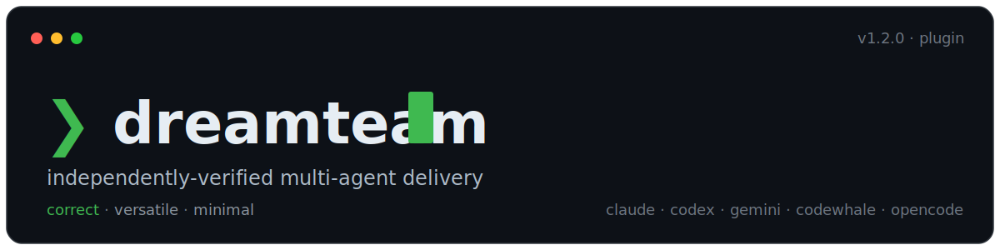
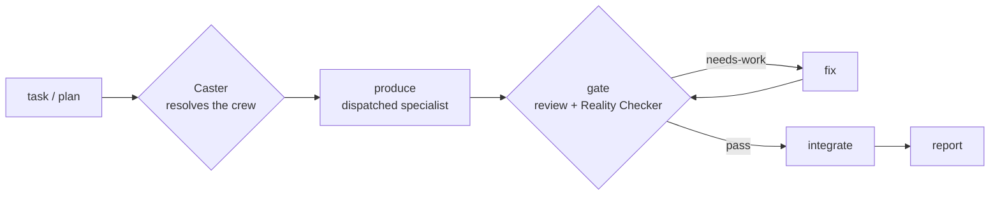

<p align="center">
  
</p>

<p align="center">
  
  
  
  
</p>

<p align="center"><b>AI agents say "done" too easily. dreamteam makes a second, independent agent prove it before anything ships, re-running your tests and rejecting fake or over-claimed passes.</b></p>

<p align="center"><i>Minimal in both directions: dreamteam itself is one skill, not a platform — and its producers ship the least code that fully works, never by cutting validation or security.</i></p>

<p align="center">
  <a href="#try-it">Try it</a> ·
  <a href="#why-dreamteam">Why</a> ·
  <a href="#install">Install</a> ·
  <a href="#quickstart">Quickstart</a> ·
  <a href="#how-it-works">How it works</a> ·
  <a href="#what-a-run-looks-like">Demo</a> ·
  <a href="#cost--scale">Cost</a> ·
  <a href="#profiles-seed-set">Profiles</a> ·
  <a href="#mechanics--reference">Reference</a> ·
  <a href="#dependencies">Dependencies</a> ·
  <a href="#faq--troubleshooting">FAQ</a>
</p>

## Try it

After [install](#install), point it at your repo in read-only mode:

```
/dreamteam --profile audit "find bugs in this repo"
```

It assembles a review crew, reproduces every finding against your real code, and prints a report — the read-only `audit` profile's only artifact ([Safety guardrails](#safety-guardrails) is honest about what enforces that). It fans out parallel specialists, so check [Cost & scale](#cost--scale) before an exhaustive (`--depth exhaustive`) audit.

## What it does

- Point it at a task or an approved plan, and it assembles a crew of specialists to do the work.
- Nothing is marked done until a second, independent agent (the Reality Checker) re-runs the tests and matches every claim to real evidence.
- One loop handles building, auditing, research, and QA. Only the crew changes.

## Why dreamteam?

Most agent tools hand a task to a model and trust whatever comes back: the model reports passing tests, and sometimes they don't pass — or the passing test never ran the code under it. dreamteam is built for that gap: everything it produces goes through a verification gate, and an independent Reality Checker re-runs the evidence before anything is called done. A green suite that still passes against a deliberately broken implementation is rejected, not trusted.

It is also deliberately small — one skill you invoke per task, not a framework you build against or a platform you live in, running on five CLIs rather than one runtime. The nearest comparison, [ECC](https://github.com/affaan-m/ECC), is honestly a different category: an always-on operator layer, broader and deeper than dreamteam — whereas dreamteam stays a per-task skill whose learning is confined to your project and never rewrites the skill without your sign-off.[^prior-art]

| | Dispatches work | Gates the result | No framework to build | Cross-CLI |
|---|:---:|:---:|:---:|:---:|
| Plain subagent dispatch / Task tool | ✓ | — | ✓ | — |
| CrewAI · AutoGen · LangGraph | ✓ | partial (you wire it) | — | — |
| **dreamteam** | **✓** | **✓ (mandatory, vacuity-checked)** | **✓** | **✓** |

## Install

**Prerequisites:** a supported CLI (Claude Code, Codex, Gemini, CodeWhale, or OpenCode); a git repo for build-type runs (work happens in isolated git worktrees); paid model-API usage — a run spawns several agents ([Cost & scale](#cost--scale)).

Three steps; install commands live here, and other sections link back.

**Step 1. Install the two required dependencies.** dreamteam composes existing skills rather than reinventing them.

In Claude Code:

```
/plugin marketplace add obra/superpowers-marketplace
/plugin install superpowers@superpowers-marketplace
```

In a terminal:

```
npx skills add vercel-labs/skills --skill find-skills
```

- **superpowers** provides `brainstorming`, `writing-plans`, `using-git-worktrees`, `verification-before-completion`, and `finishing-a-development-branch` ([github.com/obra/superpowers](https://github.com/obra/superpowers)).
- **find-skills**, from the Vercel `skills` CLI ([skills.sh](https://www.skills.sh) · [github.com/vercel-labs/skills](https://github.com/vercel-labs/skills)), discovers and installs other skills and backs the advisory recommender.

A missing dependency warns but never blocks — dreamteam substitutes or flags it at runtime — but any path needing it stays dark until installed. The check also lists a third, **recommended** item, `ui-ux-pro-max` (composed by the `ux-designer` / design roles); [Dependencies](#dependencies) has the full picture, including the optional `ai-research` skills.

**Step 2. Install dreamteam.** Clone this repo and run the installer for your OS from its root; it publishes `skills/dreamteam/` to `~/.claude/skills/dreamteam/` and runs the dependency check. A skill-only install registers none of the 21 vendored agents (the bundled specialist crew in `vendor/`) — [Dependencies](#dependencies) covers how the crew resolves then.

```
bash ./install.sh       # Linux / macOS
pwsh ./install.ps1      # Windows
```

**Step 3. Invoke it** with `/dreamteam` — see [Quickstart](#quickstart).

<details>
<summary><b>Other CLIs &amp; the published-plugin install</b></summary>

dreamteam also installs as a Claude Code plugin marketplace — the one path that registers the 21 vendored agents and auto-wires the enforcement hook (inert until armed, per [Safety guardrails](#safety-guardrails)):

```
/plugin marketplace add adnantaufique/dreamteam
/plugin install dreamteam@dreamteam-marketplace
```

*(Available now that the repo is public but untested from a client yet; if it doesn't resolve, `install.sh` / `install.ps1` always works.)*

**Other CLIs.** The skill is CLI-agnostic — tool names, dispatch, and model tiers resolve per `skills/dreamteam/references/platforms.md`. Sync scripts (each has a `.ps1` twin for Windows): `sync-to-codex` → `~/.agents/skills/dreamteam/` (+ an `AGENTS.md` pointer); `sync-to-gemini` (+ `gemini-extension.json`) → `~/.gemini/agents/dreamteam/`; `sync-to-codewhale` → `~/.codewhale/skills/dreamteam/` (load via `/skills`); `sync-to-opencode` → `~/.config/opencode/skills/dreamteam/` (native `skill` tool). OpenCode also natively reads `~/.claude/skills`, so Step 2 alone covers it — its sync script is only for setups that never ran the Claude installer.

</details>

## Quickstart

With [Install](#install) done, point dreamteam at a task or an approved plan — the slash command is shorthand, and plain language ("use dreamteam to add OAuth login") runs the same gated loop:

```
/dreamteam "add OAuth login to our web app"           # auto-picks the web crew, runs the gated loop
/dreamteam docs/plans/my-plan.md                      # execute an already-approved plan
```

> **Opt-in, then session-sticky:** nothing runs until you invoke dreamteam — but once invoked, later artifact-producing tasks in the same session route through it too. Say **"don't use dreamteam for this"** to skip one task, or **"stop using dreamteam this session"** to turn it off (a later `/dreamteam` re-arms it).

**Not for:** a single-step task one agent handles, trivial edits, or work you haven't asked to orchestrate.

## How it works

One loop, `produce → gate → fix → integrate`, runs across every domain. A **workstream** is one independently produced, independently reviewed slice of the task (a plan usually splits into several); the **gate** is the review panel every workstream must pass.



Three parts do the work:

- **conductor** — the loop you talk to: dispatches specialists, reports each verdict, never writes code itself.
- **Caster** — the selector: picks the crew and gives each role a cost-aware model **tier** (`cheap → standard → capable → max`, resolved to a concrete model per platform).
- **Reality Checker** — the always-on reviewer: re-runs the build and tests (data↔claim for research) and rejects anything it can't verify.

The three stages:

1. **Caster resolves the crew.** Explicit `--roster/--profile/--skills` wins; else a confident profile match takes the fast path; else a Caster agent reads the live agent registry and `find-skills`. The manifest prints before the run, one rationale line per pick.
2. **The loop runs per workstream** (`references/loop.md`): produce, gate, fix, integrate, report. Independent workstreams run concurrently, each file-mutating producer in its own git worktree; a mandatory re-anchor keeps the conductor dispatching instead of coding inline.
3. **The gate checks the work** (`references/gate.md`). A reviewer panel runs in parallel, split between static review and verification, and rejects faked or over-claimed coverage: a passing test is checked for vacuity — reasoned about always, perturbed to confirm it goes red on a broken implementation when cheap — and mocks can't stand in for the unit under test. Findings synthesize into `pass`, `fix-then-pass`, or `needs-work`; the fix loop is capped.

The deterministic edge cases — recommendations, `audit`, tier escalation, platforms, learning, the raw-idea wrapper, the flag grammar — live in [Mechanics / Reference](#mechanics--reference) below.

## What a run looks like

A run prints the crew manifest, then reports every workstream verdict with its evidence. Two moments from the transcript below (`/dreamteam "add OAuth login to our web app"`) show the point — the gate rejecting a green-but-fake test:

```text
Reality Checker  ✗ HIGH: refresh-token test is vacuous — still green when verify_signature()
                   is stubbed to return True (mock stands in for the unit under test)
```

…and the pass landing only after the fix survives perturbation:

```text
re-verify → Reality Checker ✓ : perturbed verify_signature() → suite goes RED as expected
verdict: PASS · evidence: 17 unit + 4 integration green, non-vacuous (mutation-confirmed)
```

<details>
<summary><b>Full annotated transcript</b> — the crew manifest, the vacuous-test rejection, a CSRF must-fix, and a tier escalation on a BLOCKED producer</summary>

```text
$ /dreamteam "add OAuth login to our web app"

Caster → crew manifest (profile: web · platform: claude)
  planner    : writing-plans (skill)
  producers  :
    backend  → Backend Architect      capable → opus    : OAuth flow + token handling — multi-file, security-sensitive
    frontend → Frontend Developer      standard → sonnet  : login UI wiring — integration against the new endpoints
  reviewers  :
    Code Reviewer                      capable → opus    : static review + over-engineering / diff-scope check
    Reality Checker                    capable → opus    : re-runs tests; claim↔evidence; mock-integrity (always on)
    Security Engineer                  capable → opus    : added — auth/token handling on the critical path
  gate_policy : min_pass=all · max_fix_iterations=2
  workstream_strategy: sequential

Execution mode? Background subagents or the Workflow tool? [background] › background

── WS1: backend OAuth flow ──────────────────────────────────────────────
Dispatching `backend` for WS1 at capable, risk high — background subagents (session mode).
  producer → DONE: /auth/oauth routes + token exchange; 14 unit + 3 integration tests
  gate (parallel panel) → synthesizing…
    Reality Checker  ✗ HIGH: refresh-token test is vacuous — still green when verify_signature()
                       is stubbed to return True (mock stands in for the unit under test)
    Security Engineer ✗ HIGH: state param not validated on callback → CSRF on the OAuth handshake
    Code Reviewer    ✓ pass
  verdict: fix-then-pass (2 must-fixes) → re-dispatching producer with the fix list (iter 1/2)
  producer → DONE: real signature check asserted; state validated + test added
  re-verify → Reality Checker ✓ : perturbed verify_signature() → suite goes RED as expected;
                                   Security Engineer ✓ : CSRF test passes
  verdict: PASS · evidence: 17 unit + 4 integration green, non-vacuous (mutation-confirmed)
  integrate → merged branch ws1-oauth-backend; worktree cleaned

── WS2: login UI ────────────────────────────────────────────────────────
Dispatching `frontend` for WS2 at standard, risk standard — background subagents (session mode).
  producer → BLOCKED: token-refresh race needs more reasoning than this tier carries
  WS2 failed gate at standard → retrying at capable
  producer (capable) → DONE: refresh guarded; 6 component tests
  gate → Reality Checker ✓ · Code Reviewer ✓   verdict: PASS · evidence: 6 component tests green
  integrate → merged branch ws2-login-ui; worktree cleaned

Run complete · 2/2 workstreams integrated.
Retro → learning persisted: "web+auth → add Security Engineer by default; assert non-vacuous
        token tests." No skill-edit deltas proposed.
```

</details>

Every line is a real format from the skill: the manifest (`references/caster.md`), the re-anchor and escalation lines (`references/loop.md`), the verdict and its evidence (`references/gate.md`). Newer runs additionally gloss each verdict in one plain-language sentence and close the user-facing report with handoff notes naming what still needs a human (`references/loop.md` §Report) — the transcript predates those lines.

## Cost & scale

A run is not a single prompt: a typical task spawns the Caster, a planner, one producer per workstream, a reviewer panel (the Reality Checker plus any domain reviewers, all `capable`), fix-loop re-dispatches, and a post-run retro — roughly N times one prompt's tokens, minutes rather than seconds, a handful to about a dozen dispatches (more for `--profile audit --depth exhaustive`, which is budget-printed and confirm-gated). Counting the transcript above: 12 dispatches — four producer runs (two initial, one fix re-dispatch, one tier escalation), seven reviewer runs (a three-reviewer panel, two re-verifies, WS2's two-reviewer gate), and the retro; the crew came via the profile fast path, so no Caster-agent dispatch; and no planner dispatch either — the printed manifest casts `planner : writing-plans (skill)`, a composed skill, not a dispatched agent (`references/caster.md`: a skill-planner carries no tier and is never dispatched). Beyond that, measure your own runs rather than trusting a made-up figure.

Reviewers never drop below `capable`, so they're the largest steady cost — but the gate is risk-proportional by default: a low-risk workstream gets the Reality Checker alone, only a high-risk one the full panel (`--full-gate`, `--cost quality`, or an explicit roster pins it everywhere). To economize:

- dispatch runs in the background, so it doesn't tie up your session (OpenCode excepted — [Invocation shapes](#invocation-shapes))
- `--cost cheap` biases producers to the cheapest tier that fits
- `--autonomy confirm` gates spend by confirming the crew and each verdict
- `--depth shallow|module` and a tighter task keep fan-out small

The run also sizes its defaults to the plan powering it: a capacity profile (`--capacity`, default auto — read off the conducting model's own tier) remaps concurrency, the dispatch backstop, and the confirm threshold for low/standard/high plans, and on a small plan resolves the reviewer floor to the best tier the plan actually has, declared once at cast — never the gate bar, which is identical at every capacity. On a below-capable conducting model a weak-conductor guard also arms (off the model itself, whatever the flag says): borderline calls come to you instead of being guessed — safer, not smarter, at the price of a few more pauses.

Default-on caps ride underneath; [Safety guardrails](#safety-guardrails) specifies them.

## Profiles (seed set)

| Profile | Producers | Gate | Workstreams |
|---|---|---|---|
| **mobile-dev** | Mobile App Builder (iOS · Android · cross-platform) · UI Designer *(Caster may re-add a design-architect for complex mobile)* | Code Reviewer, Reality Checker | sequential |
| **web** | Backend Architect · Frontend Developer · UI Designer | Code Reviewer, Reality Checker (+ Security Engineer if auth/payments) | sequential |
| **ai-research** | *expand* (grow the research): deep-research-agent + AI Engineer · *polish* (write it up): AI Engineer / Technical Writer | methodology reviewer, Reality Checker | **parallel** (expand and polish side by side) |
| **devops** | DevOps Automator | Reality Checker, Security Engineer | sequential |
| **qa** | quality-engineer + Test Results Analyzer | Reality Checker | sequential |
| **audit** *(read-only)* | dimension specialists as producers — *bugs:* Code Reviewer · Security Engineer · Performance Benchmarker · root-cause-analyst · *map:* Explore · Software Architect · system-architect + a synthesizer | Reality Checker (+ dimension specialists as verifiers) | **parallel** |
| **ml-dev** | AI Engineer / python-expert · build-error-resolver / pytorch-build-resolver (training/CUDA build-fix) *(ML development, distinct from ai-research)* | methodology reviewer, Reality Checker (+ Security Engineer if infra/data-sensitive) | sequential |
| **debug** | root-cause-analyst (investigate) · host code producer (fix) *(reproduce-first; skips plan-writing, but lands the fix)* | Reality Checker (reproduce-then-resolve: RED before / GREEN after + a regression test), Code Reviewer | sequential |
| **ux-designer** | UI Designer (+ ui-ux-pro-max) · deep-research-agent (redesign) · Frontend Developer (if code emitted) *(design-led; a11y non-waivable)* | a UX/design reviewer, an accessibility reviewer, Reality Checker (re-derives a11y evidence) (+ Code Reviewer if code emitted) | sequential |
| **tutor** | deep-research-agent (understand) · Technical Writer (explain) | Reality Checker (explanation↔source; source wins), a clarity reviewer | sequential |
| **generic** | general-purpose | Code Reviewer, Reality Checker | sequential |

- `--profile android` is a back-compat alias for `mobile-dev`. `audit` is read-only: the report is the artifact, nothing lands in the audited tree, `integrate` is a no-op ([Audit and review](#audit-and-review)).
- `Software Architect` and `system-architect` in the `audit` row are two distinct bundled agents (agency-agents and SuperClaude); map mode casts both.
- Rosters and tiers are defaults: `--roster` overrides, and anything richer goes to the Caster agent over the live registry — a security- or architecture-sensitive producer on the critical path can be cast above its default, as the transcript's OAuth backend was (`standard` → `capable`).
- With `graphify` installed, `audit` is graph-backed: an AST code-graph built once at fan-out as navigation infra. The graph never decides a verdict — the gate still reproduces every finding against live code.

## Mechanics / Reference

The flags and the deterministic edge cases behind the loop.

### Invocation shapes

Beyond [Quickstart](#quickstart): `--profile ai-research` splits a run into parallel workstreams in isolated worktrees; `--execution` pre-sets how a run executes, skipping the one-time prompt:

```
/dreamteam --profile ai-research "reproduce the paper's ablation and extend it to two more datasets"
/dreamteam --execution workflow "add OAuth login to our web app"    # the Workflow tool (Claude Code only)
/dreamteam --execution background "find bugs in this repo"          # background subagents (default, every CLI)
/dreamteam --cost cheap --autonomy confirm "…"                      # economize + gate every verdict
```

Neither execution mode ties up your session, except OpenCode: its native dispatch is synchronous in core, so a run blocks the chat unless you add a community background plugin (`references/platforms.md`) — the dispatch → gate → integrate contract holds either way. The Workflow tool suits many independent workstreams; `--execution workflow` on the other four CLIs is invalid and falls back to background subagents. With no flag, dreamteam asks once per session, defaulting to background.

### Full flag grammar

```
/dreamteam <task | plan-ref>
      [--profile mobile-dev|web|ai-research|devops|qa|generic|audit|ml-dev|debug|ux-designer|tutor]
      [--depth shallow|module|exhaustive] [--mode bugs|map] [--graph on|off|auto]
      [--roster planner=…,producers=<role>:<agent>[@<tier>][+<skill>];…,reviewers=…]
      [--skills a,b] [--autonomy auto|confirm|step] [--execution background|workflow]
      [--models …] [--cost cheap|balanced|quality] [--capacity auto|low|standard|high] [--full-gate] [--platform claude|codex|gemini|codewhale|opencode]
      [--retro on|off] [--learnings <path>] [--evolve [generations=N]]
      [--repo <path>] [--branch <name>] [--parallel]
```

### Selection and cost

- **Cost-aware tiers.** Each role gets the cheapest tier that fits (`references/platforms.md` maps tiers to concrete models); reviewers stay `capable`; the loop escalates a tier on a gate failure or a BLOCKED producer. Tune with `--cost` / `--models`.
- **Cross-platform.** All five CLIs; `--platform` auto-detects the host.
- **Recommendations** (`references/recommend.md`). When a best-fit skill isn't installed, the Caster surfaces advice from skills.sh (via `find-skills`) plus the awesome-claude-code `THE_RESOURCES_TABLE.csv` — it recommends, never installs. An opt-in, human-gated `setup` role can install one approved, pinned candidate; the gate then checks the installed identity and that the command carried no auto-confirm flag.

### Audit and review

- **`audit` profile** (`references/audit.md`). A read-only, many-reviewer adversarial sweep — bug-finder (`--mode bugs`) or project map (`--mode map`). Dimension reviewers run as producers; the gate reproduces or refutes each candidate and drops what doesn't reproduce. `--depth shallow|module|exhaustive` tunes fan-out.
- **Devil's advocate on unanimous** (`references/gate.md`). One opt-in extra `capable` reviewer charged with refuting a unanimous pass — off by default, on for `audit`.
- **Pre-fix refuter** (`references/gate.md`). A must-fix that is only a prediction (a reasoned `file:line`, no run evidence) gets one targeted dispatch, before the first fix iteration, to run the check that settles it: hard refuting evidence drops it; no evidence leaves it standing. One evidence run — not another reviewer — beats a fix round spent on a false positive.
- **Evidence at emit time** (`references/gate.md`). No finding counts without its motivating artifact — the `file:line`, the failing command and output, or a reproducing case. Anything less is an unverified note, never a must-fix, until re-raised with evidence; at synthesis a refuted prediction still loses to hard evidence.
- **Confidence on every finding** (`references/gate.md`). Confidence (how certain it's real) rides alongside severity (how much it hurts), so a proven bug outranks a hunch — but it affects display order only: high severity always surfaces, the Reality Checker always reports, must-fix status rides on severity alone. Ranking down a low-signal note is allowed; burying a real one is not.
- **Security method** (`references/security.md`). When security is in scope, the reviewer can follow a stack-neutral OWASP/STRIDE checklist — secrets, dependencies and supply chain, CI/CD, the OWASP Top 10, STRIDE per component, LLM/AI surfaces, the skill supply chain — instead of whatever the cast agent happens to know. A checklist the reviewer reads, not a scanner or a new gate step; findings enter the gate like any other. (Adapted from [gstack](https://github.com/garrytan/gstack).)

### Safety guardrails

Being honest about what bounds a run: on the background-subagent path (four of the five CLIs, plus Claude Code's default mode) the guards are model-compliance rules and tripwires, not a hard sandbox — nothing at the OS level halts a misbehaving agent, so the rules are written to be hard to miss and checked as the run goes. On Claude Code with the Workflow tool a real limit sits underneath, but the design doesn't lean on it.

- **Recursion firewall.** A dispatched agent is a **leaf**: it does its one briefed task and returns — never re-invoking `/dreamteam`, conducting, or spawning subagents. Only the conductor dispatches, so the call tree stays one level deep by identity, not by a counter; session stickiness binds the conductor alone. The firewall is stated twice on purpose: atop the skill for an agent that auto-loads it, and in every dispatch brief for one that never loads it.
- **Run-wide caps, on by default with no flag.** A concurrency ceiling (8, hard limit 16) serializes the excess rather than fanning wider; a cumulative dispatch backstop (60) stops the run and escalates to you rather than continuing quietly; a confirm-gate prints projected cost and waits for your OK before a large fan-out, even under `--autonomy auto`. The stated defaults are the high capacity row — a low- or standard-capacity run resolves them to 3/30 · 5/45 (the capacity profile, [Cost & scale](#cost--scale)); the hard limit never changes. In Workflow mode a user token target adds a fourth: the harness's live remaining budget becomes a run ceiling, met by scheduling alone — serialize, shrink the remaining fan-out, stop and escalate — never by thinning the review gate.
- **Execution discipline.** A producer watches every shell command to completion and reads its output and exit status before moving on — an unobserved command is not evidence. Long-running work gets a bounded, timed wait, then a check; past the bound, kill and retry once, or report the hang and continue with what it has. A discipline the model follows, not something the harness enforces.
- **Optional hard enforcement (Claude Code).** `PreToolUse` hooks fire inside dispatched subagents too (a leaf's tool calls carry a non-null agent id; the conductor's don't), so an **opt-in, off-by-default** hook — `hooks/dreamteam-run-policy.js`, armed by `DREAMTEAM_ENFORCE=1` — turns two prose guards into real blocks: a leaf trying to dispatch or re-invoke `/dreamteam` is denied, and the conductor is hard-capped at `max_total_dispatches` — at the hook's own threshold (default 60; it doesn't read the capacity profile), so on a low- or standard-capacity run the armed layer sits looser beneath the prose cap, fail-safe in direction — set `DREAMTEAM_MAX_TOTAL_DISPATCHES` to align it with a lower capacity row. **Fail-open** (any parse or IO error allows — it can't block a legitimate call) and **Claude-Code-only**: prose stays the default everywhere, the *only* layer on the other four CLIs — and the confirm-gate and shell-timeout discipline stay prose on Claude Code too. The plugin install auto-wires it (still inert until armed); a skill-only install copies the JSON from `hooks/hooks.json` into `settings.json` (matcher `Agent|Task|Skill`; swap `${CLAUDE_PLUGIN_ROOT}` for your checkout's absolute path) plus `"env": { "DREAMTEAM_ENFORCE": "1" }`. Knobs: `DREAMTEAM_MAX_TOTAL_DISPATCHES` (default 60), `DREAMTEAM_RUN_TTL_MS` (stale-run reset, default 12h).

### Learning and lifecycle

- **Learns from runs** (`--retro`, default on). A post-run retro (`references/retro.md`) writes evidence-tagged learnings the Caster consults on later runs of the same project; skill self-edits are proposed and human-gated, never automatic. The retro also accumulates a per-agent scouting ledger — first-try, drop, and refuted-prediction counts the Caster uses to choose between fitting agents, advisory and never a ban. `--evolve` opts into a benchmark-evolution loop for ai-research (`references/evolve.md`).
- **Wrapper** (`references/wrapper.md`). A raw idea (rather than a plan) runs `brainstorming → writing-plans → loop`, keeping the human approval gates.
- **Autonomy.** `auto` proposes the crew then proceeds, reporting at gates; `confirm` confirms the crew and each verdict; `step` pauses per workstream. On top of that cadence, each mid-run call is classified: Mechanical (fixed by plan or evidence — proceed), Taste (defensible either way — proceed, note the choice), or User-Challenge (changes your stated direction, or costly and hard to reverse) — which always pauses and asks, even under `auto`, defaulting to your choice. The report carries a decision log of these calls, followed by the handoff notes that close the user-facing report — report-only; dreamteam stays stateless.

## Dependencies

Everything resolves or substitutes at runtime; a missing item warns rather than blocks ([Install](#install) states the stays-dark caveat and holds the commands).

- **Required:** the **superpowers** plugin and **find-skills** ([Install → Step 1](#install) lists what each provides); `find-skills` also backs the recommender, alongside the awesome-claude-code `THE_RESOURCES_TABLE.csv`.
- **Recommended:** `ui-ux-pro-max`, composed onto UI Designer by the `ux-designer` profile when installed; absent, UI Designer designs natively — accessibility stays non-waivable either way.
- **Agents.** Cast per profile — the [Profiles](#profiles-seed-set) table names each crew. **21 specialists ship vendored in `vendor/`** (agency-agents, ECC, SuperClaude — MIT, provenance in [THIRD_PARTY_NOTICES.md](THIRD_PARTY_NOTICES.md)), registered by the plugin install via `plugin.json`; a skill-only install registers none, so the Caster resolves names from your live agent registry, substituting or flagging what's missing. `Explore` and `general-purpose` are host built-ins.
- **ai-research skills** (optional): `creative-thinking-for-research`, `brainstorming-research-ideas`, `literature-review`, `ml-paper-writing` — installed the same `npx skills add` way as `find-skills`.
- **Composed when installed** (optional, degrade gracefully): `karpathy-guidelines` (every code-producing producer), `superpowers:systematic-debugging` (the `debug` investigator), `architecture-reviewer` (the wrapper's optional tri-review); `ml-dev`'s `mle-workflow` ships bundled in `skills/mle-workflow/` — nothing to install.
- **ponytail** (optional): an external enforcer of dreamteam's native minimal-code principle — the gate checks over-engineering with or without it; composed onto code producers when installed.
- **graphify** (optional; recommend-only, never bundled): an external AST code-graph the Caster uses as navigation infra (`--graph on|off|auto`), mostly for `audit` and codebase-heavy runs; absent, agents read the tree directly, and it never decides a verdict ([github.com/safishamsi/graphify](https://github.com/safishamsi/graphify); install command in `references/recommend.md`).
- **Recommendation sources.** Beyond the bundled and required set, the Caster recommends from the upstream source (agency-agents, ECC, SuperClaude, superpowers, ui-ux-pro-max, graphify) and prints the command for you to run — it never installs anything itself (`references/recommend.md`).

## Layout

```
.claude-plugin/plugin.json    # plugin manifest — registers the vendored agents + the hook
skills/dreamteam/
  SKILL.md            # spine: invocation, flags, "you are the conductor", stickiness, autonomy
  references/
    profiles.md       # domain → crew rosters + gate + default tiers
    caster.md         # crew selection, manifest schema, tier rubric, learnings consult
    gate.md           # reviewer panel, synthesis, honesty rule, capped fix loop
    loop.md           # per-workstream produce→gate→fix→integrate, escalation, re-anchor
    wrapper.md        # full-lifecycle entry (brainstorming → writing-plans → loop)
    platforms.md      # per-CLI tool / dispatch / model-tier map
    audit.md          # the audit profile — read-only sweeps
    recommend.md      # advisory recommendations (Caster recommends, never installs)
    security.md       # OWASP/STRIDE security review method
    retro.md          # post-run learnings
    learnings.md      # the learnings store the Caster consults
    evolve.md         # benchmark evolution (opt-in, ai-research)
skills/mle-workflow/  # bundled ML-engineering skill, composed by the ml-dev profile
vendor/               # 21 bundled specialist agents (agency-agents · ecc · superclaude)
hooks/                # opt-in PreToolUse enforcement (dreamteam-run-policy.js + hooks.json)
tests/scenarios.md    # S1–S64 validation scenarios + grounding dry-runs (full specs)
docs/VALIDATION.md    # the same scenarios, one line each
THIRD_PARTY_NOTICES.md            # provenance + licenses for everything vendored
install.sh / install.ps1          # Claude Code installers + dependency check
gemini-extension.json / GEMINI.md # Gemini CLI packaging
scripts/sync-to-{codex,gemini,codewhale,opencode}.*   # mirror the skill into other CLIs
```

## Validation

Validation dispatches fresh subagents at [tests/scenarios.md](tests/scenarios.md): 64 scenarios plus two grounding dry-runs, covering selection, the gate and loop, profiles, execution mode, the bundled-agent build, gate and autonomy hardening, run-level safety, resilience, cost-proportional gating, the refuter and reliability checks, dispatch efficiency, budget-aware scaling, the agent scouting ledger, plain-language run guidance, cast-time awareness (the MCP capability inventory + skill-usage feedback), capacity parity (the plan-sized capacity profile), and the weak-conductor guard (checklist-and-pause discipline on a below-capable conductor). The subagent's behavior is the test, so re-run after any edit (install first). [docs/VALIDATION.md](docs/VALIDATION.md) lists every scenario in one line.

## FAQ / Troubleshooting

<details>
<summary><b>1. The dependency check printed <code>[ ! ]</code> warnings. Is it broken?</b></summary>

No — the check is best-effort: it warns rather than blocks, and a flagged path won't fire until you install the item ([Install → Step 1](#install) has the commands). Markers: `[ok bundled]` ships with the plugin; `[ ! ]` is a missing depended-on or recommended item; `[recommend-only]` is optional, per profile; `[built-in] Explore, general-purpose (host-resolved at runtime)` never needs installing.
</details>

<details>
<summary><b>2. How do I cancel or abort a run?</b></summary>

Dispatch doesn't hold your prompt (OpenCode excepted — [Invocation shapes](#invocation-shapes)); stop it the way you stop any background agent work: interrupt the session, or cancel the background task or Workflow. The conductor only integrates after a passing gate, so stopping mid-workstream leaves nothing half-merged. `--autonomy confirm` or `step` gives explicit stop points.
</details>

<details>
<summary><b>3. How much does it cost, and how do I economize?</b></summary>

Roughly N times a single prompt — [Cost & scale](#cost--scale) has the dispatch anatomy, a counted example, and the knobs.
</details>

<details>
<summary><b>4. It ran inline and didn't dispatch. Is that expected?</b></summary>

No. The conductor dispatches every workstream to a background agent; editing files directly to produce one is drift the skill guards against (a genuinely tiny, non-workstream edit you asked for directly may be done inline, announced as such first). The flip side: once invoked, dreamteam is session-sticky — later artifact-producing tasks route through it until you say **"don't use dreamteam for this"** (skip one task) or **"stop using dreamteam this session"** (off until a later `/dreamteam` re-arms it).
</details>

## License

Apache-2.0. See [LICENSE](LICENSE).

[^prior-art]: dreamteam didn't invent verification-led orchestration — larger systems, [ECC](https://github.com/affaan-m/ECC) among them, run their own verification loops and quality gates. ECC is an always-on operator layer: dozens of agents, a large skill library, persistent memory, and learning that runs unprompted and platform-wide. dreamteam learns too ([Learning and lifecycle](#learning-and-lifecycle)); the difference is the shape, not whether it happens — its learning stays inside one skill and one project, skill-changing edits are proposed for your approval rather than applied, and the honesty gate is never traded away: a single opt-in skill rather than a standing platform, with a gate mandatory by construction instead of optional wiring.
