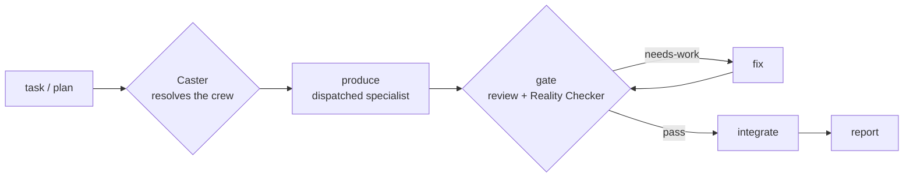

<p align="center">
  
</p>

<p align="center">
  
  
  
  
</p>

<p align="center"><b>AI agents say "done" too easily. dreamteam makes a second, independent agent prove it before anything ships, re-running your tests and rejecting fake or over-claimed passes.</b></p>

<p align="center"><i>Minimal by design, too: the least code that actually works, without dropping validation or security to get there.</i></p>

## Try it (one command)

After [install](#install), point it at your repo in read-only mode:

```
/dreamteam --profile audit "find bugs in this repo"
```

It assembles a review crew, reproduces every finding against your real code, and prints a report. Nothing is written to your tree.

## What it does

- Point it at a task or an approved plan, and it assembles a crew of specialists to do the work.
- Nothing is marked done until a second, independent agent (the Reality Checker) re-runs the tests and matches every claim to real evidence.
- One loop handles building, auditing, research, and QA. Only the crew changes.

## Why dreamteam?

Most agent tools hand a task to a model and trust whatever comes back. The model reports that the tests pass; sometimes they don't, or the passing test never actually ran the code under it. dreamteam is built for that gap. Everything it produces goes through a verification gate, and an independent Reality Checker re-runs the evidence before anything is called done. A green suite that still passes against a deliberately broken version gets rejected, not trusted.

It is also deliberately small. dreamteam is one skill you invoke per task, not a framework you build against or a platform you install and live in. The same loop handles builds, audits, research, and QA, and it runs on Claude Code, Codex, Gemini, CodeWhale, and OpenCode rather than a single runtime.

The project people most often reach for as a comparison is ECC, and the honest answer is that it is a different category. ECC is an always-on operator layer with dozens of agents, a large skill library, persistent memory, and learning that runs in the background. It is broader and deeper than dreamteam. dreamteam learns too. A post-run retro writes evidence-tagged learnings the Caster consults on later runs of the same project, and anything that would change the skill itself is proposed for you to approve rather than applied on its own. For ai-research, `--evolve` adds an opt-in benchmark-evolution loop. So the difference from ECC is the shape of that learning, not whether it happens. ECC's runs unprompted and platform-wide; dreamteam's stays inside one skill and one project, and never rewrites itself without your sign-off. The one thing it will not trade away is the honesty gate.[^prior-art]

<details>
<summary>How it compares to plain dispatch and to agent frameworks</summary>

| | Dispatches work | Gates the result | No framework to build | Cross-CLI |
|---|:---:|:---:|:---:|:---:|
| Plain subagent dispatch / Task tool | ✓ | — | ✓ | — |
| CrewAI · AutoGen · LangGraph | ✓ | partial (you wire it) | — | — |
| **dreamteam** | **✓** | **✓ (mandatory + mutation-checked)** | **✓** | **✓** |

</details>

## Install

**Prerequisites**

- a supported CLI: Claude Code, Codex, Gemini, CodeWhale, or OpenCode
- a git repo for build-type runs, where work happens in isolated git worktrees
- paid model-API usage, since a run spawns several agents (see [Cost & scale](#cost--scale))

Three steps. These are the only install commands in this README; everything else links back here.

**Step 1. Install the two required dependencies.** dreamteam composes existing skills rather than reinventing them, and it needs both of these.

```
/plugin marketplace add obra/superpowers-marketplace && /plugin install superpowers@superpowers-marketplace
npx skills add vercel-labs/skills --skill find-skills
```

- **superpowers** is a Claude Code plugin. It provides `brainstorming`, `writing-plans`, `using-git-worktrees`, `verification-before-completion`, and `finishing-a-development-branch` ([github.com/obra/superpowers](https://github.com/obra/superpowers)).
- **find-skills** is a skill from the Vercel `skills` CLI ([skills.sh](https://www.skills.sh)). It discovers and installs other skills, and it backs the advisory recommender ([github.com/vercel-labs/skills](https://github.com/vercel-labs/skills)).

A missing dependency warns but never blocks. dreamteam substitutes or flags it at runtime. The catch is that any path needing it stays dark until you install it. The `ai-research` profile pulls in a few more optional skills; [Dependencies](#dependencies) has the full list.

**Step 2. Install dreamteam.** Clone this repo, then run the installer for your OS from its root. It publishes `skills/dreamteam/` to `~/.claude/skills/dreamteam/` and runs the dependency check.

```
bash ./install.sh       # Linux / macOS
pwsh ./install.ps1      # Windows
```

**Step 3. Invoke it** with `/dreamteam`. See [Quickstart](#quickstart) and [Mechanics / Reference](#mechanics--reference) for the invocation shapes.

<details>
<summary><b>Other CLIs &amp; the published-plugin install</b></summary>

dreamteam also installs as a Claude Code plugin marketplace:

```
/plugin marketplace add adnantaufique/dreamteam
/plugin install dreamteam@dreamteam-marketplace
```

*(Available now that the repo is public, though it hasn't been tested from a client yet. If the marketplace command doesn't resolve in your client, the `install.sh` / `install.ps1` path above always works.)*

**Other CLIs.** The skill is CLI-agnostic. Tool names, dispatch, and model tiers resolve per `skills/dreamteam/references/platforms.md`:

| CLI | Sync | Installs to |
|----|------|-------------|
| Codex | `scripts/sync-to-codex.sh` | `~/.agents/skills/dreamteam/` (+ `AGENTS.md` pointer) |
| Gemini | `scripts/sync-to-gemini.sh` (+ `gemini-extension.json`) | `~/.gemini/agents/dreamteam/` |
| CodeWhale | `scripts/sync-to-codewhale.sh` | `~/.codewhale/skills/dreamteam/` (load via `/skills`) |
| OpenCode | `scripts/sync-to-opencode.sh` | `~/.config/opencode/skills/dreamteam/` (native `skill` tool; also auto-read from `~/.claude/skills/`) |

(`.ps1` variants exist for each on Windows.)

OpenCode is a special case: it natively reads `~/.claude/skills`, so the [Step 2](#install) `install.sh` / `install.ps1` already makes dreamteam available there with no sync step. The `sync-to-opencode` script is only for OpenCode-only setups that haven't run the Claude installer.

</details>

## Quickstart

With [Install](#install) done, point dreamteam at a task or an approved plan:

```
/dreamteam "add OAuth login to our web app"           # auto-picks the web crew, runs the gated loop
/dreamteam docs/plans/my-plan.md                      # execute an already-approved plan
```

> You don't have to use the slash command. You can also ask your session agent in plain language, like "use dreamteam to add OAuth login," and it runs the same gated loop. The `/dreamteam` command is shorthand for that.

> The first example uses the `superpowers` sub-skills and `find-skills`. If they aren't installed, the dependency check prints `[ ! ]` warnings and those paths won't fire. See [Install → Step 1](#install).

> **Opt-in:** dreamteam runs multi-agent orchestration only when you invoke it.

## How it works

One loop, `produce → gate → fix → integrate`, runs across every domain. Only the crew changes.



Three parts do the work, glossed on first use:

- **conductor** — the loop you talk to. It dispatches work to specialist agents and reports each verdict. It never writes code itself.
- **Caster** — the selector. It reads your task, picks the crew, and gives each role a cost-aware model tier. The crew prints before any work runs.
- **Reality Checker** — the always-on reviewer. It re-runs the build and tests (or checks data against the claim for research) and rejects anything it can't verify.

The three stages in detail:

1. **Caster resolves the crew.** An explicit `--roster/--profile/--skills` wins. Failing that, a confident profile match takes the fast path. Failing that, a Caster agent reads the live agent registry and `find-skills` and returns a crew manifest. The crew prints before the run, with a one-line rationale per pick.
2. **The loop runs per workstream** (`references/loop.md`): produce, gate, fix, integrate, report. Independent workstreams run concurrently, each file-mutating producer in its own git worktree. A mandatory per-workstream re-anchor keeps the conductor dispatching instead of coding inline.
3. **The gate checks the work** (`references/gate.md`). A reviewer panel runs in parallel, split between static review and verification. The Reality Checker is always on the panel: it matches claims against evidence (tests for code, data against claim for research) and rejects faked or over-claimed coverage. A mutation check sharpens this further. A passing test has to go red on a broken implementation, and mocks can't stand in for the unit under test. Findings synthesize into `pass`, `fix-then-pass`, or `needs-work`, and the fix loop is capped.

<details>
<summary>Three design pillars</summary>

- **correct.** Every workstream passes a verification gate. The Reality Checker sits on every panel, matches claims against evidence (tests for code, data against claim for research), and throws out faked or over-claimed coverage.
- **versatile.** One loop, a swappable crew. The same machinery handles builds, audits, research, and QA. Only the crew changes.
- **minimal.** The least code that fully works, without cutting validation or security to get there.

</details>

The deterministic edge cases live in [Mechanics / Reference](#mechanics--reference): the recommendation system, the `audit` profile, model-tier escalation, cross-platform resolution, learning and evolution, the raw-idea wrapper, and the full flag grammar.

## What a run looks like

A run prints the crew manifest first. Then it drives each workstream through produce → gate → fix → integrate and reports every verdict with the evidence behind it. Here's an abbreviated transcript for `/dreamteam "add OAuth login to our web app"`:

<details>
<summary>Annotated run transcript</summary>

```text
$ /dreamteam "add OAuth login to our web app"

Caster → crew manifest (profile: web · platform: claude)
  planner    : writing-plans (skill)
  producers  :
    backend  → Backend Architect      capable → opus    : OAuth flow + token handling — multi-file, security-sensitive
    frontend → Frontend Developer      standard → sonnet  : login UI wiring — integration against the new endpoints
  reviewers  :
    Code Reviewer                      capable → opus    : static review + over-engineering / diff-scope check
    Reality Checker                    capable → opus    : re-runs tests; claim↔evidence; mock-integrity (always on)
    Security Engineer                  capable → opus    : added — auth/token handling on the critical path
  gate_policy : min_pass=all · max_fix_iterations=2
  workstream_strategy: sequential

Execution mode? Background subagents or the Workflow tool? [background] › background

── WS1: backend OAuth flow ──────────────────────────────────────────────
Dispatching `backend` for WS1 at capable — background subagents (session mode).
  producer → DONE: /auth/oauth routes + token exchange; 14 unit + 3 integration tests
  gate (parallel panel) → synthesizing…
    Reality Checker  ✗ HIGH: refresh-token test is vacuous — still green when verify_signature()
                       is stubbed to return True (mock stands in for the unit under test)
    Security Engineer ✗ HIGH: state param not validated on callback → CSRF on the OAuth handshake
    Code Reviewer    ✓ pass
  verdict: fix-then-pass (2 must-fixes) → re-dispatching producer with the fix list (iter 1/2)
  producer → DONE: real signature check asserted; state validated + test added
  re-verify → Reality Checker ✓ : perturbed verify_signature() → suite goes RED as expected;
                                   Security Engineer ✓ : CSRF test passes
  verdict: PASS · evidence: 17 unit + 4 integration green, non-vacuous (mutation-confirmed)
  integrate → merged branch ws1-oauth-backend; worktree cleaned

── WS2: login UI ────────────────────────────────────────────────────────
Dispatching `frontend` for WS2 at standard — background subagents (session mode).
  producer → BLOCKED: token-refresh race needs more reasoning than this tier carries
  WS2 failed gate at standard → retrying at capable
  producer (capable) → DONE: refresh guarded; 6 component tests
  gate → Reality Checker ✓ · Code Reviewer ✓   verdict: PASS · evidence: 6 component tests green
  integrate → merged branch ws2-login-ui; worktree cleaned

Run complete · 2/2 workstreams integrated.
Retro → learning persisted: "web+auth → add Security Engineer by default; assert non-vacuous
        token tests." No skill-edit deltas proposed.
```

</details>

Every line is a real format from the skill: the manifest (`references/caster.md`), the per-workstream re-anchor and escalation lines (`references/loop.md`), and the `pass / fix-then-pass / needs-work` verdict with its evidence (`references/gate.md`).

## Cost & scale

A run is not a single prompt. A typical task spawns the Caster, a planner, one producer per workstream, a reviewer panel (the Reality Checker plus any domain reviewers, all at the `capable` tier), any fix-loop re-dispatches, and a post-run retro.

So expect roughly N times the tokens and cost of one prompt, and minutes of wall-clock rather than seconds. In practice that's a handful to about a dozen agent dispatches, more for `--profile audit --depth exhaustive` (which is budget-printed and confirm-gated). The numbers depend on the task, so measure your own runs rather than trusting a made-up figure.

Reviewers never drop below `capable`, so they're the largest steady cost. To economize:

- dispatch always runs in the background, so it doesn't tie up your session
- `--cost cheap` biases producers to the cheapest tier that fits; reviewers stay `capable`
- `--autonomy confirm` gates spend by confirming the crew and each verdict before work proceeds
- `--depth shallow|module` and a tighter task keep fan-out small

Those are the knobs you turn. A run also carries caps you don't set: a concurrency ceiling, a cumulative dispatch backstop that stops and escalates if a run runs away, and a confirm-gate that prints the projected cost before a large fan-out, even under `--autonomy auto`. See [Safety guardrails](#safety-guardrails).

## Profiles (seed set)

<details>
<summary>Crew rosters per profile (producers · gate · workstream strategy)</summary>

| Profile | Producers | Gate | Workstreams |
|---|---|---|---|
| **mobile-dev** | Mobile App Builder (iOS · Android · cross-platform) · UI Designer *(Caster may re-add a design-architect for complex mobile)* | Code Reviewer, Reality Checker | sequential |
| **web** | Backend Architect · Frontend Developer · UI Designer | Code Reviewer, Reality Checker (+ Security Engineer if auth/payments) | sequential |
| **ai-research** | *expand:* deep-research-agent + AI Engineer · *polish:* AI Engineer / Technical Writer | methodology reviewer, Reality Checker | **parallel** (expand ∥ polish) |
| **devops** | DevOps Automator | Reality Checker, Security Engineer | sequential |
| **qa** | quality-engineer + Test Results Analyzer | Reality Checker | sequential |
| **audit** *(read-only)* | dimension specialists as producers — *bugs:* Code Reviewer · Security Engineer · Performance Benchmarker · root-cause-analyst · *map:* Explore · Software Architect + synthesizer | Reality Checker (+ dimension specialists as verifiers) | **parallel** |
| **ml-dev** | AI Engineer / python-expert · build-error-resolver (training/CUDA build-fix) *(ML development, distinct from ai-research)* | methodology reviewer, Reality Checker (+ Security Engineer if infra/data-sensitive) | sequential |
| **debug** | root-cause-analyst (investigate) · host code producer (fix) *(reproduce-first; skips plan-writing, but lands the fix)* | Reality Checker (reproduce-then-resolve: RED before / GREEN after + a regression test), Code Reviewer | sequential |
| **ux-designer** | UI Designer (+ ui-ux-pro-max) · deep-research-agent (redesign) · Frontend Developer (if code emitted) *(design-led; a11y non-waivable)* | a UX/design reviewer, an accessibility reviewer, Reality Checker (re-derives a11y evidence) (+ Code Reviewer if code emitted) | sequential |
| **tutor** | deep-research-agent (understand) · Technical Writer (explain) *(understand anything, then explain it simply)* | Reality Checker (explanation↔source; source wins), a clarity reviewer | sequential |
| **generic** | general-purpose | Code Reviewer, Reality Checker | sequential |

</details>

`--profile android` still works as a back-compat alias for `mobile-dev`. The `audit` profile is read-only: the report is the artifact, and nothing lands in the audited tree (see [Mechanics / Reference](#mechanics--reference)). When `graphify` is installed, the `audit` profile is also graph-backed: the Caster builds an AST code-graph once at fan-out as navigation infra. The graph never decides a verdict, so the gate still reproduces every finding against live code. Each role carries a default model tier. For anything richer or cross-domain, the Caster agent reasons over the live registry, so a security- or architecture-sensitive producer can be cast above its profile default when it sits on the critical path. The OAuth backend in the transcript above is one example, bumped from `standard` to `capable`. Rosters are only defaults; override them with `--roster`.

## Mechanics / Reference

The core is the loop above. These are the flags and the deterministic edge cases behind it.

### Invocation shapes

Beyond the [Quickstart](#quickstart) examples:

`--profile ai-research` splits a run into parallel workstreams in isolated worktrees:

```
/dreamteam --profile ai-research "salvage the leakage finding: expand ∥ polish"
```

`--execution` pre-sets how a run executes, so dreamteam skips the one-time prompt:

```
/dreamteam --execution workflow "add OAuth login to our web app"   # orchestrate via the Workflow tool (Claude Code)
/dreamteam --execution background "find bugs in this repo"          # multiple background subagents
```

Both modes run without tying up your session. Background subagents are the default and run on every CLI. The Workflow tool is Claude-Code-only, and it fits a run with many independent workstreams. With no flag, dreamteam asks once per session and defaults to background. `--execution workflow` on Codex, Gemini, CodeWhale, or OpenCode is invalid, since none of them has a Workflow tool, so the run falls back to background subagents.

Economize by combining the cost and autonomy flags:

```
/dreamteam --cost cheap --autonomy confirm "…"       # economize + gate every verdict
```

### Full flag grammar

```
/dreamteam <task | plan-ref>
      [--profile mobile-dev|web|ai-research|devops|qa|generic|audit|ml-dev|debug|ux-designer|tutor]
      [--depth shallow|module|exhaustive] [--mode bugs|map] [--graph on|off|auto]
      [--roster planner=…,producers=<role>:<agent>[@<tier>][+<skill>];…,reviewers=…]
      [--skills a,b] [--autonomy auto|confirm|step] [--execution background|workflow]
      [--models …] [--cost cheap|balanced|quality] [--platform claude|codex|gemini|codewhale|opencode]
      [--retro on|off] [--learnings <path>] [--evolve [generations=N]]
      [--repo <path>] [--branch <name>] [--parallel]
```

### Selection and cost

- **Cost-aware model tiers.** The Caster gives each role the cheapest tier that fits. The abstract scale is `cheap → standard → capable → max`, resolved to a concrete model per platform (`references/platforms.md`). Reviewers stay `capable`, and the loop escalates a tier on a gate failure or a BLOCKED producer. Tune it with `--cost` and `--models`.
- **Cross-platform.** Runs on Claude Code, Codex, Gemini, CodeWhale, and OpenCode. `--platform` auto-detects the host.
- **Recommendation system** (`references/recommend.md`). When a best-fit skill isn't installed, the Caster surfaces an advisory recommendation from skills.sh (via `find-skills`) plus the awesome-claude-code `THE_RESOURCES_TABLE.csv`. Discovery in, advice out. It recommends but doesn't install. An opt-in, human-gated `setup` role can install one approved, pinned candidate, and the gate checks the installed identity and that the command carried no auto-confirm flag.

### Audit and review

- **`audit` profile** (`references/audit.md`). A read-only, ultrareview-style sweep, either a bug-finder (`--mode bugs`) or a project map (`--mode map`). Dimension reviewers are dispatched as producers, and the gate then reproduces or refutes each candidate. Findings that don't reproduce get dropped. `integrate` is a no-op, since the report is the artifact and nothing lands in the audited tree. `--depth shallow|module|exhaustive` tunes fan-out, with exhaustive budget-printed and confirm-gated.
- **Devil's advocate on unanimous** (`references/gate.md`). An opt-in reviewer: one extra `capable` reviewer charged with refuting a unanimous pass. Off by default, on for `audit`.
- **Evidence at emit time** (`references/gate.md`). A reviewer can't raise a finding without quoting what motivates it: the `file:line`, the failing command and its output, or a case that reproduces it. A finding with nothing behind it doesn't count. It's logged as an unverified note, never a must-fix, until someone re-raises it with the evidence. That catches a confidently-wrong claim before it's ever voiced, on top of the older rule that a refuted prediction loses to hard evidence at synthesis time.
- **Confidence on every finding** (`references/gate.md`). Findings carry a confidence (how certain the claim is real) alongside severity (how much it would hurt). The two are separate axes, so the panel can surface a proven bug ahead of a hunch. Confidence only affects display order. It never hides anything: a high-severity finding always surfaces whatever its confidence, the Reality Checker always reports, and must-fix status still rides on severity alone. Ranking down a low-signal note is allowed; burying a real one is not.
- **Security method** (`references/security.md`). When security is in scope, the security reviewer can follow a stack-neutral OWASP and STRIDE checklist (secrets, dependencies and supply chain, CI/CD config, the OWASP Top 10, STRIDE per component, LLM/AI surfaces, and the skill supply chain) instead of relying on whatever the cast agent happens to know. It's a checklist the reviewer reads, not a scanner or a new gate step. Its findings enter the gate like any other, with the same emit-time evidence and the same verdict.

### Safety guardrails

Two things keep a run bounded, and it's worth being honest about what they are. On the background-subagent path (four of the five CLIs, plus Claude Code's default mode) they're model-compliance rules and tripwires, not a hard sandbox: nothing at the OS level halts a misbehaving agent, so the rules are written to be hard to miss and are checked as the run goes. On Claude Code with the Workflow tool a real limit sits underneath as a second layer, but the design doesn't lean on it.

- **Recursion firewall.** A dispatched agent is a leaf. It does its one task and returns, and it never re-invokes `/dreamteam`, acts as the conductor, or spawns its own subagents. Only the conductor dispatches, so the call tree stays one level deep by identity rather than by a counter anyone tracks. Session stickiness, the rule that keeps later tasks inside dreamteam once you've invoked it, is the conductor's alone and never reaches a leaf. The firewall is stated twice on purpose: at the top of the skill for an agent that auto-loads it, and in every dispatch brief for one that never loads it at all. Three run-wide caps ride alongside it, all on by default with no flag: a concurrency ceiling (8, hard limit 16) that serializes the excess instead of fanning wider, a cumulative dispatch backstop (60) that stops the run and escalates to you instead of continuing quietly, and a confirm-gate that prints the projected cost and waits for your OK before a large fan-out, even under `--autonomy auto`.
- **Execution discipline.** A producer that runs a shell command watches it to completion and reads the output and exit status before it moves on. It won't proceed on a command it didn't see finish, because a command you never observed is not evidence. Anything long-running or backgrounded gets a bounded wait with a timeout and then a check of the result, never an open-ended one; if it hangs past the bound the producer kills and retries once, or reports the hang and continues with what it has, rather than parking the task in a wait state. This is a discipline the model follows, not something the harness enforces: the harness owns the shell, and this is the obligation to actually watch it.

### Learning and lifecycle

- **Learns from runs** (`--retro`, default on). A post-run retro (`references/retro.md`) emits evidence-tagged learnings the Caster consults next time. Skill self-edits are proposed and human-gated, never automatic. `--evolve` adds an opt-in benchmark-evolution loop for ai-research (`references/evolve.md`).
- **Wrapper** (`references/wrapper.md`). For a raw idea rather than a plan, it sequences `brainstorming → writing-plans → loop` and keeps the human approval gates in place.
- **Autonomy.** `auto` proposes the crew, then proceeds and reports at gates. `confirm` confirms the crew and each verdict. `step` pauses per workstream. On top of that cadence, the conductor classifies each mid-run call as Mechanical (decided by the plan or the evidence, so it just proceeds), Taste (defensible either way, so it proceeds and notes the choice), or a User-Challenge (a call that would change your stated direction or take a costly, hard-to-reverse step). A User-Challenge always pauses and asks, even under `auto`, and defaults to your choice. The run report ends with a short decision log of these calls. It lives in the report only, with no persisted store, since dreamteam stays stateless.

## Dependencies

Everything is resolved or substituted at runtime. The installers report what's missing as a warning, not a block, though a path needing a missing dependency stays dark until you install it. For the install commands, see [Install](#install).

- **superpowers plugin** (REQUIRED). Provides `brainstorming`, `writing-plans`, `using-git-worktrees`, `verification-before-completion`, and `finishing-a-development-branch` ([github.com/obra/superpowers](https://github.com/obra/superpowers)).
- **find-skills** (REQUIRED). From the `skills` CLI ([github.com/vercel-labs/skills](https://github.com/vercel-labs/skills)). It also backs the advisory recommendation in `references/recommend.md`, alongside the awesome-claude-code `THE_RESOURCES_TABLE.csv`.
- **ai-research skills** (optional). `creative-thinking-for-research`, `brainstorming-research-ideas`, `literature-review`, and `ml-paper-writing`, used by the ai-research profile. Each installs the same `npx skills add …` way.
- **agents.** Cast per profile. Reality Checker and Code Reviewer are used widely. The `audit` profile adds `root-cause-analyst`, `Explore`, `Software Architect`, `Performance Benchmarker`, and `Security Engineer`. `general-purpose` is built-in.
- **ponytail** (optional). An external enforcer of dreamteam's native minimal-code principle; the gate checks for over-engineering with or without it. It's composed onto code-producing producers when installed.
- **graphify** (optional). An external AST code-graph tool the Caster uses as navigation infra (`--graph on|off|auto`), mostly for the `audit` profile and codebase-heavy runs. When it's absent, agents read the tree directly, and it never decides a verdict. It's recommend-only and never bundled; `references/recommend.md` carries the install command and the full behavior ([github.com/safishamsi/graphify](https://github.com/safishamsi/graphify)).
- **Recommendation sources.** When a profile needs an agent, skill, or command beyond the bundled and required set, the Caster recommends it from its upstream source and prints the command for you to run (agency-agents, ECC, SuperClaude, superpowers, ui-ux-pro-max, and graphify). It never installs anything itself. See `references/recommend.md`.

## Layout

```
.claude-plugin/plugin.json    # Claude Code plugin manifest
skills/dreamteam/
  SKILL.md            # spine + invocation + flags + "you are the conductor" rule + autonomy
  references/
    profiles.md       # domain → crew rosters + gate + default tiers
    caster.md         # crew selection + manifest schema + model-tier rubric + learnings consult
    gate.md           # reviewer panel + synthesis + honesty rule + capped fix loop
    loop.md           # per-workstream produce→gate→fix→integrate + escalation + re-anchor + retro
    wrapper.md        # full-lifecycle entry (brainstorming → writing-plans → loop)
    platforms.md      # per-CLI tool / dispatch / model-tier map (Claude · Codex · Gemini · CodeWhale · OpenCode)
    audit.md          # the audit profile — read-only bug-finding / project-map sweeps
    recommend.md      # advisory skill/resource recommendations (Caster recommends, never installs)
    security.md       # OWASP/STRIDE security review method (adapted from gstack)
    retro.md          # post-run learnings (Layer A)
    learnings.md      # the learnings store the Caster consults
    evolve.md         # benchmark evolution (Layer B — opt-in, ai-research)
tests/scenarios.md    # S1–S48 subagent validation scenarios + grounding dry-runs (full Input/Expected specs)
docs/VALIDATION.md    # the same scenarios as a one-line indexed list
install.ps1 / install.sh                     # Claude Code installers + dependency check
gemini-extension.json / GEMINI.md            # Gemini CLI packaging
scripts/sync-to-{codex,gemini,codewhale,opencode}.*   # mirror the skill into other CLIs
```

## Validation

The skill is validated by dispatching fresh subagents at the scenarios in [tests/scenarios.md](tests/scenarios.md): 48 of them plus two grounding dry-runs, covering selection, the gate, the loop, the profiles, execution mode, the bundled-agent build, the gate and autonomy hardening, and the run-level safety guardrails. The subagent's behavior is the test, so re-run after any edit (install first). [docs/VALIDATION.md](docs/VALIDATION.md) lists every scenario with a one-line summary.

## FAQ / Troubleshooting

<details>
<summary><b>1. The dependency check printed <code>[ ! ]</code> warnings. Is it broken?</b></summary>

No. The check is best-effort, so it warns rather than blocks. dreamteam resolves or substitutes missing pieces at runtime through the Caster and `find-skills`. The catch is that any path needing a missing dependency won't fire until you install the flagged item. An agent flagged `(may be built-in/plugin; verified at runtime)` is often already available and just isn't on disk where the check looks.
</details>

<details>
<summary><b>2. Where do I get <code>superpowers</code> and <code>find-skills</code>?</b></summary>

See [Install → Step 1](#install) for the commands and sources.
</details>

<details>
<summary><b>3. How do I cancel or abort a run?</b></summary>

Dispatch is always background, so the run isn't holding your prompt. Stop it the way you stop any background agent work in your CLI: interrupt the session, or cancel the background task or Workflow. The conductor only integrates after a passing gate, so stopping mid-workstream leaves nothing half-merged. In-flight producers run in their own worktrees, which are cleaned up on a pass. Use `--autonomy confirm` or `step` if you want explicit stop points.
</details>

<details>
<summary><b>4. How much does it cost, and how do I economize?</b></summary>

A run spawns several agents, so it costs roughly N times a single prompt. See [Cost & scale](#cost--scale). Economize with `--cost cheap` (cheaper producers; reviewers stay `capable`), `--autonomy confirm` (gate spend at the crew and each verdict), and a tighter `--depth shallow|module`.
</details>

<details>
<summary><b>5. It ran inline and didn't dispatch. Is that expected?</b></summary>

No. dreamteam's conductor dispatches every workstream to a background agent. Once invoked, the session is sticky, so later artifact-producing tasks also go through dreamteam. If you see it editing files directly to produce a workstream, that's drift the skill guards against. A genuinely tiny, non-workstream edit, like a typo fix you asked for directly, may be done inline, but it gets announced as such first.
</details>

## License

Apache-2.0. See [LICENSE](LICENSE).

[^prior-art]: dreamteam didn't invent verification-led orchestration. loki-mode and the Edict pattern cover nearby ground, and larger systems like ECC and metaswarm run their own verification loops and quality gates. The difference is the shape: a single opt-in skill rather than a standing platform, with one honesty gate that is mandatory by construction instead of optional wiring. metaswarm is the closest functional peer, since it also spans Claude, Gemini, and Codex and enforces gates of its own.
